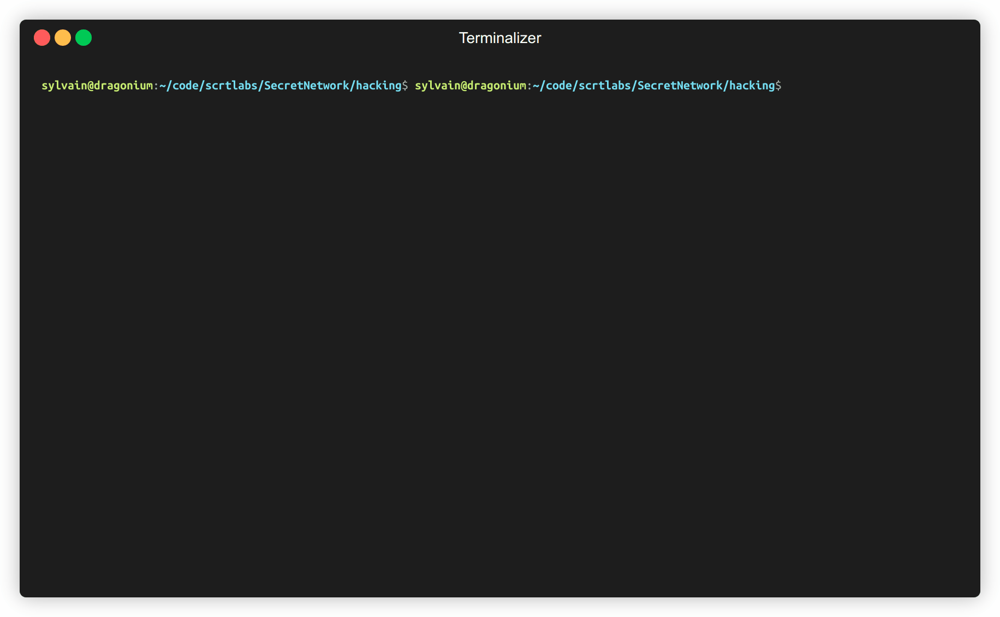

# Running the MEV Demo

### Update Git Submodules
Fetch the git submodules by running the following command:

```shell
git submodule update --init --recursive --remote
```

### Requirements
Docker Engine: https://docs.docker.com/engine/install/
Docker compose

### Setup Environment

```shell
make start
```
[Full description of start_node.sh](./scripts/README.md#start_nodesh)

The above command will:

1) Start a validator node (node-1) and a non-validator node (node-2)

2) Store and instantiate Toy uniswap demo contracts and set up the initial states for MEV sandwhich attack.
The pool sizes are 1000 for `token_a` and 2000 for `token_b`.
The victim and adversary account in the toy-swap contract each have a balance
of 100 `token_a` and `token_b`.

3) Store and instantiate snip-20 contract and set up the initial states for the SNIP-20 privacy attack demos.
The victim account has a balance of 12343. Two attacker accounts have balance of 10000 each.

4) Shut down node-1 to launch the attack in simulation mode without broadcasting any transactions to the network.

### Launch MEV Attack

```shell
make sandwich-attack
```

[Full description of sandwich-attack.sh](./scripts/README.md#sandwich-attacksh)

The above command simulates an adversary executing the following steps:

1) Generate a victim swap transaction to swap 10 `token_a` for at least 20 `token_b`.

2) Find a front-run transaction by bisection search that, when executed before the
   victim's transaction, won't fail the victim's transaction. The front-run transaction
   found swaps 20 `token_a` with a slippage limit of 0, resulting in obtaining 40
   `token_b`.

3) After the victim's transaction, the adversary executes a back-run transaction to
   sell the 40 `token_b`, increasing their balance of `token_a` by 1 and maintaining
   their balance of `token_b`.




#### Transfer amount privacy attack
Getting transfer amount. This script generates a victim transaction sending 10 of a SNIP-20 token to another account. It figures out the transfer amount prints it.

```shell
make receiver-privacy-attack
```


[Full description of test_snip20.sh](./scripts/README.md#test_snip20sh)

The above command simulates an adversary executing the following steps:

1) Generate a victim transaction to transfer 10 tokens to another account

2) Find a transfer amount by bisection search to figure out the tranfer amount:
   * that sets the victim's balance to 0
   * sends an amount `guess` to the victim's account resulting in the victim's account having a balance of `guess`
   * execute the victim's transaction to see if `guess` was enough to conver the victim's transfer transaction
3) If the `guess` was enough to cover the victim's transfer transaction then `guess` is the transfer amount

#### Account balance privacy attack
Getting the account balance. The script prints out the victim's balance of 12343.

```shell
make balance-privacy-attack
```

[Full description test_balance.sh](./scripts/README.md#test_balancesh)

The above command simulates an adversary executing the following steps:

1) Execute balance inflation by creating transfers between the attacker's two accounts, reseting the account balance to the original value before the transfer, and repeating this until the balance has the maximum value.

2) Find a transaction by bisection search that transfers `guess` from the attacker's account to the victim's account until it causes an overflow error.

3) The victim's balance is the `2**128-1-guess`

### Cleanup

```shell
docker compose down --volumes
```


[//]: # ()
[//]: # (### Rebuild )

[//]: # ()
[//]: # (Rebuild `go-cosmwasm/src` and `x/` and restart node &#40;after `./start_node.sh` was run&#41;)

[//]: # ()
[//]: # (* From outside docker container)

[//]: # ()
[//]: # (`./rebuild_node.sh`)

[//]: # ()
[//]: # (* From inside docker container)

[//]: # ()
[//]: # (```bash)

[//]: # (docker-compose exec localsecret-2 bash)

[//]: # ($ ./scripts/rebuild.sh &> /root/out &)

[//]: # ($ cat out)

[//]: # (```)

[//]: # ()
[//]: # (* shutdown containers)

[//]: # ()
[//]: # (`docker-compose down`)

[//]: # ()
[//]: # (* delete network)

[//]: # ()
[//]: # (`docker network rm hacking_default`)

[//]: # ()
[//]: # (### Other)

[//]: # (#### Update protobuf for rpc calls)

[//]: # ()
[//]: # (* Update proto spec and other relevant files)

[//]: # ()
[//]: # (    * [msg.proto]&#40;../proto/secret/compute/v1beta1/msg.proto&#41;)

[//]: # (    * [alias.go]&#40;../x/compute/alias.go&#41;)

[//]: # (    * [cli/tx.go]&#40;x/compute/client/cli/tx.go&#41;)
[//]: # (    * [rest/tx.go]&#40;x/compute/client/rest/tx.go&#41;)

[//]: # (    * [handler.go]&#40;x/compute/handler.go&#41;)

[//]: # (    * [msg_server.go]&#40;x/compute/internal/keeper/msg_server.go&#41;)

[//]: # (    * [codec.go]&#40;x/compute/internal/types/codec.go&#41;)

[//]: # (    * [msg.go]&#40;x/compute/internal/types/msg.go&#41;)

[//]: # ()
[//]: # (* generate protobuf files `make proto-gen`)

[//]: # ()
[//]: # (    * you can ignore errors: `W0123 19:43:24.908481     375 services.go:38] No HttpRule found for method: Msg....` )

[//]: # ()
[//]: # (* build image `./build_image.sh` or `./rebuild_node.sh`)

[//]: # ()
[//]: # (#### Keeper)

[//]: # ([keeper.go]&#40;../x/compute/internal/keeper/keeper.go#L478&#41;)
